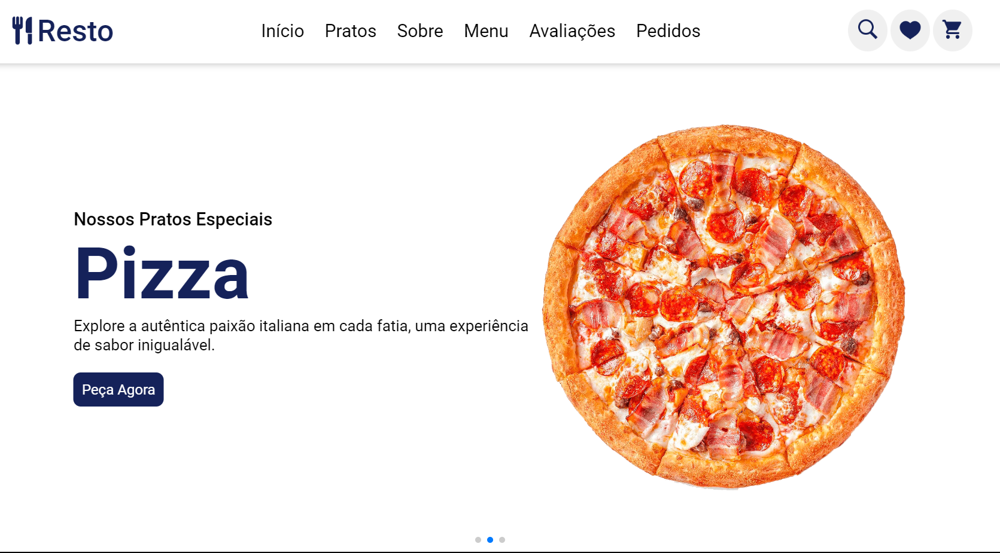
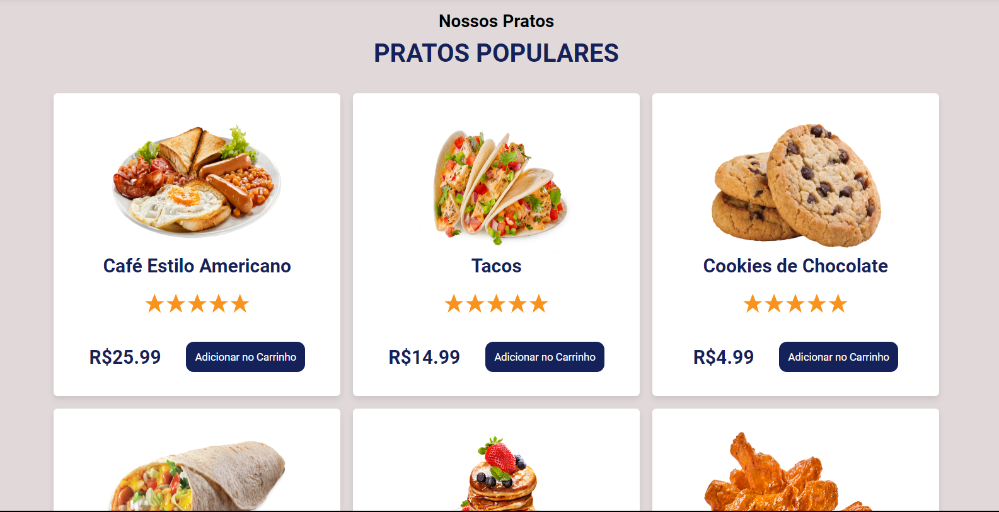

# Culinary Dreams Hub (Resto)


## Descrição
Culinary Dreams Hub é uma landing page para um restaurante fictício chamado Resto. Proporcionando uma experiência interativa e agradável para os usuários em todos os dispositivos.

## Funcionalidades
O projeto possui as seguintes seções:

1. **Carousel de Pratos:** Apresenta uma variedade de pratos em um carrossel, exibindo informações sobre cada prato.

2. **Seleção de Pratos Populares:** Apresenta uma seleção de pratos com seus respectivos preços e botão para adicionar ao carrinho (botão ilustrativo).

3. **Sobre o Restaurante:** Uma breve descrição sobre o restaurante mostrando seus benefícios.

4. **Pratos Especiais do Dia:** Destaca os pratos especiais oferecidos pelo restaurante no dia.

5. **Avaliação dos Clientes:** Exibe avaliações dos clientes sobre a experiência no restaurante.

6. **Formulário de Pedido:** Permite que os usuários façam pedidos de comida através de um formulário (botão de pedir fictício).

## Layout Mobile
O Culinary Dreams Hub também possui uma versão otimizada para dispositivos móveis, garantindo uma experiência consistente em diferentes dispositivos e tamanhos de tela.

## Layout Web
Versão otimizada para dispositivos web





## Tecnologias Utilizadas

O projeto Culinary Dreams Hub foi desenvolvido utilizando as seguintes tecnologias:

- HTML
- CSS
- JavaScript

## Instalação
Para visualizar o projeto localmente, siga estes passos:

1. Clone o repositório:
    ```bash
    git clone https://github.com/EduardoDebarba/CulinaryDreamsHub.git
    ```

2. Abra o arquivo `index.html` em seu navegador web.

## Acesso ao Site
Você pode acessar o site diretamente [clicando aqui](https://eduardodebarba.github.io/CulinaryDreamsHub/).

## Contribuição
Contribuições são bem-vindas! Sinta-se à vontade para propor melhorias, corrigir bugs ou adicionar novas funcionalidades. Basta seguir estes passos:

1. Fork o projeto
2. Crie uma nova branch (`git checkout -b feature/nova-feature`)
3. Faça commit das suas alterações (`git commit -am 'Adiciona nova feature'`)
4. Faça push para a branch (`git push origin feature/nova-feature`)
5. Crie um novo Pull Request

## Autor
Eduardo Debarba Scheuermann

## Licença
Este projeto está licenciado sob a [Licença MIT](https://opensource.org/licenses/MIT).

